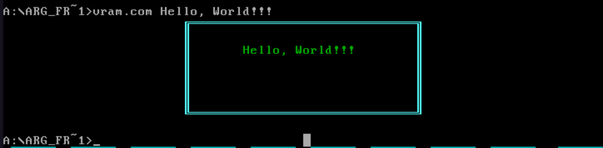
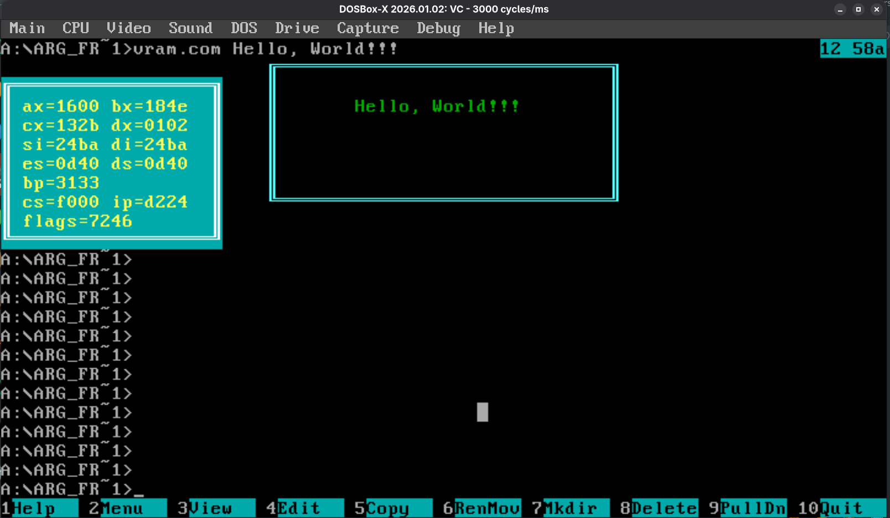

# DOS ASSEMBLY

В этом репозитории собраны задачи, которые я решал в рамках курса по ассемблеру на 16-битном Intel 8086 в MS DOS.
Все программы написаны на Turbo Assembly и тестировались в dosbox-x.

### Рамочка для аргументов

В данной задаче было предложено написать программу, напрямую работающую с memory-mapped видеопамятью. Программа считывать аргументы, переданные при запуске и отображать их в рамочке на экране. Отображать необходимо напрямую в видеопамять, без использования встроенных функций DOS. 

В процессе реализации основной задачи мне не понравилась идея выводить эту рамочку просто поверх всего текста в консоли - хотелось, чтобы рамочка сдвигала текст, прямо как обычные cli программы. Я заметил, что при сдвигании текста консоли в верх DOS делает не что иное, как простое копирование видеопамяти. А это значит, что я в своей программе могу сымитировать то же самое. И вот - спустя несколько часов отладки, я добился желаемого результата :)

Ассемблерный код и скомпилированный бинарник можно посмотреть в папке `arg_frame`

### Драйвер клавиатуры

Идея задачи - добавить хоткей, который показывает и скрывает рамочку со значениями всех регистров процессора.

Эта задача требует уже более глубокого взаимодействия с DOS и даже с таблицей прерываний процессора.

В качестве кнопки хоткея была выбрана F2. Осталось написать драйвер.

Идея - прописать свой адрес в девятом прерывании таблицы прерываний. Перед этим сдампить адрес функции доса. Далее проверять на нажатие кнопки, и если это не F2, вызывать функцию доса, а если F2 - включать/выключать рамочку.

Аналогично получилось использовать прерывание таймера - оно нужно для периодического обновления рамочки.

К рамочке добавил тройную буфферизацию. Теперь при уборке рамочки, она восстанавливает то, что было раньше на экране (и изменения, которые случились в её области, пока она висела).

Ассемблерный код и скомпилированный бинарник можно посмотреть в папке `kb_drvr`

Также к рамочке прилагается тестовая программа, которая ставит определённое значение регистрам, чтобы можно было подтвердить работоспособность драйвера:w.

### Мои PWN задачи

Ещё одной задачей была разработка PWN-задач для моего напарника на эксплуатирование уязвимостей программ.

В папке `my_pwn` можно найти бинарники `MAX_PWN1.COM` и `MAX_PWN2.COM`. Это и есть задачки. Цель - не используя пароль заставить программу вывести Access Granted.

  
Идеи задач: ВНИМАНИЕ, СПОЙЛЕР!

`MAX_PWN1.COM` - классическая задача на переполнение буффера на стэке. Для решения необходимо перезаписать ret с адресом функции, выводящей строку Access Granted. Ключ в `hinp1.bin` (использовать так: `type hinp1.bin | MAX_PWN1.COM`).

`MAX_PWN2.COM` - тоже переполнение буффера, но уже не на стэке, а в сегменте кода. Решая задачу, необходимо заметить, что этот буффер переписывает код хандлера прерывания 23h - CTRL-BREAK и прописать там команду вызова функции, выводящей Access Granted, а после вызвать прерывание с помощью комбинации клавиш или драйвера. Для разнообразия, ключ я решил собрать не как обычный бинарник, а с помощью ассемблера. Его можно посмотреть в `hinp2.asm`. После компиляции и линковки в com файл использовать так :`type hinp2.bin | MAX_PWN2.com` и нажать CTRL-BREAK (CTRL-C/триггернуть int 23h с помощью драйвера)
  

### PWN задачи напарника - мне - решения

Мой напарник также подготовил для меня две задачи с уязвимостями.

Найти их можно в папке `pwn_hacks` с названиями `PWN1.COM` и `ONROP.COM`. Цель та же - `Access Granted`.

  
Моё решение: ВНИМАНИЕ, СПОЙЛЕР!

`PWN1.COM` - посмотрев через дизассемблер заметил, что таргет пароль копируется на стэк. Также на стэк сразу за ним пишется пароль от пользователя. Тогда можно просто записать одно и то же в эти поля, чтобы пароли совпали. Так я и сделал. Ключ - в `solvpwn1.bin`

`ONROP.COM` - Эта задача уже с запутанным кодом и проверками на переполнение. Чтобы было нагляднее читать ассемблерный код, и пытаться играть на нём, я полностью переписал программу на TASM (в `mrop.tasm`). Далее заметил ветку обхода проверок и подстановку кодов возврата на стек: сначала поставил код возврата в середину функции проверки доступа, а потом написал выше её код возврата из неё сэмулировав настоящий вызов функции. И получил заветное Access Granted :) Ключ - в `solvrop.bin`
  

